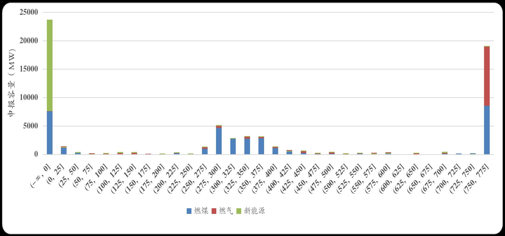
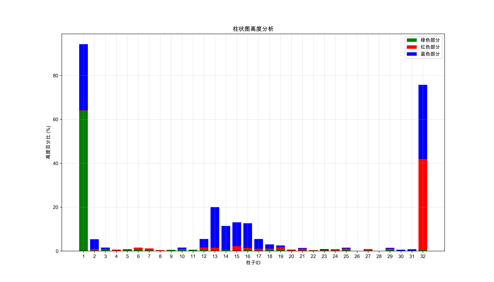

# BarDataExtractor

## 一、本工具用途

广东电力交易中心每日会披露运行日报，其中报价分布图包含了各类型机组在不同价格下的申报容量，但是图片本身无法用来二次分析，因此需要将图表数据转换成数值。以往如果需要获取图片中的信息，需要使用一些数值提取软件，如GetData Graph Digitizer、PlotDigitizer等软件，这类软件的好处是通用性好，但是缺点是需要手工处理图片，其实作用就相当于一把数字尺子而已；因此，为了减轻工作量，使用本程序，可以批量处理报价分布图，并且实现完全自动化。实现效果如下：

## 二、预处理
1. 第一步，将PDF中的报价分布图提取出来（extract_pdf_image.py）；
2. 第二步，使用waifu2x等图片放大程序，将图片适当放大（4x或者8x，这一步可以跳过,但是经过测试，似乎可以提升识别结果的精度）。

## 三、本程序模块介绍
本程序一共包含以下几部分，分别是main.py、run_no_intermediate.py、image_axis_reader.py、corp.py、bar_analyzer.py。整体思路是，首先通过AI识图，识别图中的关键信息（主要是横纵坐标的最大值），然后截取报价分布图的图表部分，最后通过计算不同颜色的柱子的高度与截图高度进行对比，再根据坐标信息转换成真实申报容量。下面对各模块的功能做详细介绍：

### 1、图像坐标识别与预处理模块
模块文件：image_axis_reader.py
功能简介：传统的OCR识别横纵坐标效果不佳，因此本模块通过调用豆包AI模型（doubao-1-5-vision-pro-32k-250115），识别图片，获取坐标横轴和纵轴的最大数值。相关API需要到字节火山中申请。本模块负责安全管理API密钥，支持首次使用时提示输入并对密钥进行加密存储，确保后续调用稳定可靠。

### 2、图像裁剪及水平线检测模块
模块文件：corp.py
功能简介：利用OpenCV提供的Canny边缘检测和霍夫直线变换技术，本模块自动识别图表中存在的水平线。通过筛选线段的长度、斜率及其在图像中的位置，程序能够剔除噪声线及图像边缘干扰，进一步合并相近的线段，从而确定有效的图表区域边界，裁剪出包含数据信息的核心区域。

### 3、堆叠柱状图数据解析模块
模块文件：bar_analyzer.py
功能简介：根据image_axis_reader.py识别到的横坐标最大值，计算图中柱子的数量，并重绘柱子，同时逐行（像素精度）计算柱子的颜色，并分别记录下每一根柱子每种颜色Y轴的最小、最大值，得到柱子的高度。将柱子高度与截图的高度进行对比，得到相对高度的百分比，然后与image_axis_reader.py识别到的纵坐标最大值相乘，得到每一段价格、不同类型机组的申报容量大小，并保存为CSV文件，同时可以生成中间件用于调试，还可以重绘报价分布图。

### 4、命令行接口及整体调用模块
模块文件：main.py、run_no_intermediate.py
功能简介：本模块作为程序入口，将前面各核心模块整合，通过命令行参数灵活配置运行方式，既可对单张图像进行处理，也支持文件夹内批量操作，并允许是否生成中间调试图像。其中，run_no_intermediate.py仅输出最终解析生成的CSV数据，实现从图像到数据的全自动转换，仅需要通过在命令行中输入'/path/to/program/run_no_intermediate.py /path/to/images'来实现相关功能。

## 四、运行效果与优势
- 自动化处理：从图像预处理、区域裁剪到数据提取，各环节实现全自动操作，无需人工手动量取，大幅提升工作效率；
- 批量处理能力：支持对整个文件夹中的图片进行批量处理，适应大量图表数据的场景；
- 高精度数据提取：借助图像识别API与OpenCV算法，实现了精准的坐标识别和图像裁剪，提高了解析柱状图数据的准确性；
- 多种输出形式：除了生成结构化的CSV数据外，还提供了带有分析标记和比较图的可视化结果，方便检查及后续统计分析；
- 灵活配置：通过命令行参数，可以根据实际需求定制图像放大、是否生成中间文件等选项，保证在不同应用场景下都能获得理想的效果。
